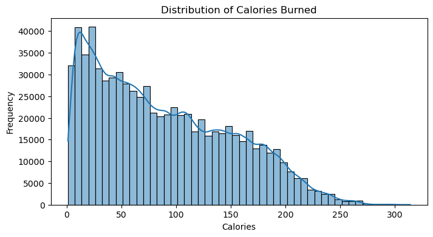
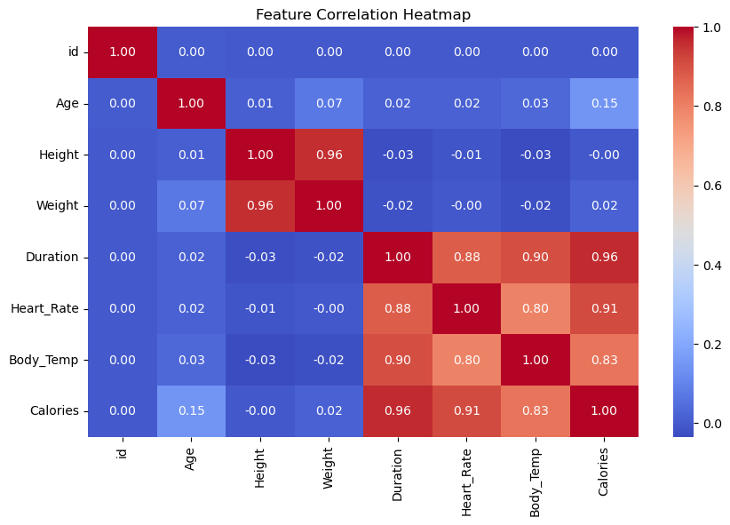
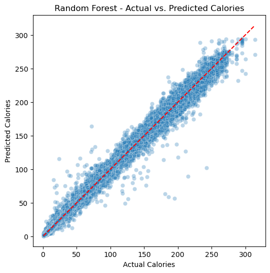
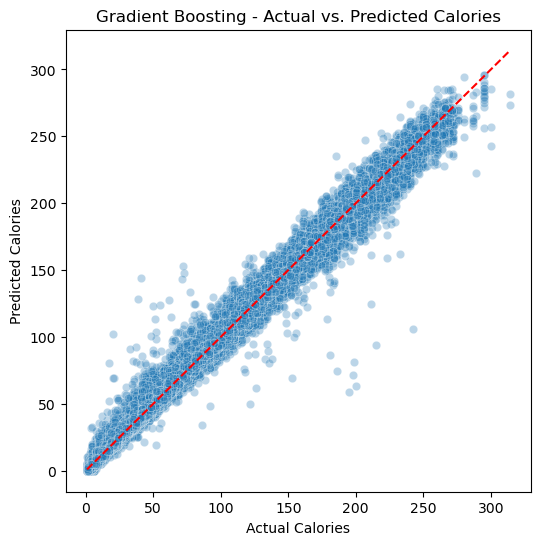
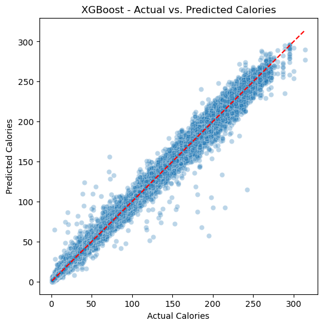

# 📚 Import Required Libraries


```python
import pandas as pd
from pathlib import Path
import numpy as np
import seaborn as sns
import matplotlib.pyplot as plt

from sklearn.model_selection import train_test_split
from sklearn.ensemble import RandomForestRegressor
from sklearn.preprocessing import LabelEncoder
from sklearn.metrics import mean_squared_log_error
```

# 🗂️ Load and Preview the Dataset


```python
test_path = Path('Predict_Calorie') / 'test.csv'
train_path = Path('Predict_Calorie') / 'train.csv'
sub_path = Path('Predict_Calorie') / 'gender_submission.csv'
test = pd.read_csv(test_path)
train = pd.read_csv(train_path)
print("Train shape:", train.shape)
print("Test shape:", test.shape)
train.head()
```

    Train shape: (750000, 9)
    Test shape: (250000, 8)


<div>
<style scoped>
    .dataframe tbody tr th:only-of-type {
        vertical-align: middle;
    }

    .dataframe tbody tr th {
        vertical-align: top;
    }

    .dataframe thead th {
        text-align: right;
    }
</style>
<table border="1" class="dataframe">
  <thead>
    <tr style="text-align: right;">
      <th></th>
      <th>id</th>
      <th>Sex</th>
      <th>Age</th>
      <th>Height</th>
      <th>Weight</th>
      <th>Duration</th>
      <th>Heart_Rate</th>
      <th>Body_Temp</th>
      <th>Calories</th>
    </tr>
  </thead>
  <tbody>
    <tr>
      <th>0</th>
      <td>0</td>
      <td>male</td>
      <td>36</td>
      <td>189.0</td>
      <td>82.0</td>
      <td>26.0</td>
      <td>101.0</td>
      <td>41.0</td>
      <td>150.0</td>
    </tr>
    <tr>
      <th>1</th>
      <td>1</td>
      <td>female</td>
      <td>64</td>
      <td>163.0</td>
      <td>60.0</td>
      <td>8.0</td>
      <td>85.0</td>
      <td>39.7</td>
      <td>34.0</td>
    </tr>
    <tr>
      <th>2</th>
      <td>2</td>
      <td>female</td>
      <td>51</td>
      <td>161.0</td>
      <td>64.0</td>
      <td>7.0</td>
      <td>84.0</td>
      <td>39.8</td>
      <td>29.0</td>
    </tr>
    <tr>
      <th>3</th>
      <td>3</td>
      <td>male</td>
      <td>20</td>
      <td>192.0</td>
      <td>90.0</td>
      <td>25.0</td>
      <td>105.0</td>
      <td>40.7</td>
      <td>140.0</td>
    </tr>
    <tr>
      <th>4</th>
      <td>4</td>
      <td>female</td>
      <td>38</td>
      <td>166.0</td>
      <td>61.0</td>
      <td>25.0</td>
      <td>102.0</td>
      <td>40.6</td>
      <td>146.0</td>
    </tr>
  </tbody>
</table>
</div>


# 🔍 Exploratory Data Analysis (EDA)


```python
train.info()
```

    <class 'pandas.core.frame.DataFrame'>
    RangeIndex: 750000 entries, 0 to 749999
    Data columns (total 9 columns):
     #   Column      Non-Null Count   Dtype  
    ---  ------      --------------   -----  
     0   id          750000 non-null  int64  
     1   Sex         750000 non-null  object 
     2   Age         750000 non-null  int64  
     3   Height      750000 non-null  float64
     4   Weight      750000 non-null  float64
     5   Duration    750000 non-null  float64
     6   Heart_Rate  750000 non-null  float64
     7   Body_Temp   750000 non-null  float64
     8   Calories    750000 non-null  float64
    dtypes: float64(6), int64(2), object(1)
    memory usage: 51.5+ MB


```python
train.describe()
```


<div>
<style scoped>
    .dataframe tbody tr th:only-of-type {
        vertical-align: middle;
    }

    .dataframe tbody tr th {
        vertical-align: top;
    }

    .dataframe thead th {
        text-align: right;
    }
</style>
<table border="1" class="dataframe">
  <thead>
    <tr style="text-align: right;">
      <th></th>
      <th>id</th>
      <th>Age</th>
      <th>Height</th>
      <th>Weight</th>
      <th>Duration</th>
      <th>Heart_Rate</th>
      <th>Body_Temp</th>
      <th>Calories</th>
    </tr>
  </thead>
  <tbody>
    <tr>
      <th>count</th>
      <td>750000.000000</td>
      <td>750000.000000</td>
      <td>750000.000000</td>
      <td>750000.000000</td>
      <td>750000.000000</td>
      <td>750000.000000</td>
      <td>750000.000000</td>
      <td>750000.000000</td>
    </tr>
    <tr>
      <th>mean</th>
      <td>374999.500000</td>
      <td>41.420404</td>
      <td>174.697685</td>
      <td>75.145668</td>
      <td>15.421015</td>
      <td>95.483995</td>
      <td>40.036253</td>
      <td>88.282781</td>
    </tr>
    <tr>
      <th>std</th>
      <td>216506.495284</td>
      <td>15.175049</td>
      <td>12.824496</td>
      <td>13.982704</td>
      <td>8.354095</td>
      <td>9.449845</td>
      <td>0.779875</td>
      <td>62.395349</td>
    </tr>
    <tr>
      <th>min</th>
      <td>0.000000</td>
      <td>20.000000</td>
      <td>126.000000</td>
      <td>36.000000</td>
      <td>1.000000</td>
      <td>67.000000</td>
      <td>37.100000</td>
      <td>1.000000</td>
    </tr>
    <tr>
      <th>25%</th>
      <td>187499.750000</td>
      <td>28.000000</td>
      <td>164.000000</td>
      <td>63.000000</td>
      <td>8.000000</td>
      <td>88.000000</td>
      <td>39.600000</td>
      <td>34.000000</td>
    </tr>
    <tr>
      <th>50%</th>
      <td>374999.500000</td>
      <td>40.000000</td>
      <td>174.000000</td>
      <td>74.000000</td>
      <td>15.000000</td>
      <td>95.000000</td>
      <td>40.300000</td>
      <td>77.000000</td>
    </tr>
    <tr>
      <th>75%</th>
      <td>562499.250000</td>
      <td>52.000000</td>
      <td>185.000000</td>
      <td>87.000000</td>
      <td>23.000000</td>
      <td>103.000000</td>
      <td>40.700000</td>
      <td>136.000000</td>
    </tr>
    <tr>
      <th>max</th>
      <td>749999.000000</td>
      <td>79.000000</td>
      <td>222.000000</td>
      <td>132.000000</td>
      <td>30.000000</td>
      <td>128.000000</td>
      <td>41.500000</td>
      <td>314.000000</td>
    </tr>
  </tbody>
</table>
</div>


# 📊 Distribution of Calories Burned


```python
plt.figure(figsize=(8, 4))
sns.histplot(train['Calories'], bins=50, kde=True)
plt.title("Distribution of Calories Burned")
plt.xlabel("Calories")
plt.ylabel("Frequency")
plt.show()
```


    

    


# 📦 Boxplot: Calories by Sex


```python
plt.figure(figsize=(6, 4))
sns.boxplot(data=train, x='Sex', y='Calories')
plt.title("Calories Burned by Sex")
plt.show()
```


    

    


# 🧮 Correlation Heatmap of Numeric Features


```python
plt.figure(figsize=(10, 6))
sns.heatmap(train.select_dtypes(include='number').corr(), annot=True, cmap="coolwarm", fmt=".2f")
plt.title("Feature Correlation Heatmap")
plt.show()

```


    

    


# 🎯 Purpose of the Model  

> The goal of this machine learning model is to **predict the number of calories burned** during a workout session based on biometric and activity-related inputs such as age, weight, height, duration, heart rate, and body temperature.  
>
> By accurately estimating calorie expenditure, the model can support applications in **fitness tracking, personalized health insights**, and **activity planning**, helping users and systems better understand energy usage in physical activities.

# 🏷️ Encode Categorical Variables


```python
le = LabelEncoder()
train['Sex'] = le.fit_transform(train['Sex'])  # male=1, female=0
test['Sex'] = le.transform(test['Sex'])
```

# 🎯 Define Features and Target


```python
X = train.drop(columns=['Calories', 'id'])
y = train['Calories']
X_test = test.drop(columns=['id'])
```

# 🧪 Function to Evaluate Performance


```python
def evaluate_and_plot(model, name, X_train, X_val, y_train, y_val):
    model.fit(X_train, y_train)
    y_pred = model.predict(X_val)
    y_pred = np.clip(y_pred, 0, None)
    y_val_clipped = np.clip(y_val, 0, None)

    rmsle = np.sqrt(mean_squared_log_error(y_val_clipped, y_pred))
    print(f"{name} - Validation RMSLE:", round(rmsle, 4))  # << changed here

    # Visualization
    plt.figure(figsize=(6, 6))
    sns.scatterplot(x=y_val, y=y_pred, alpha=0.3)
    plt.plot([y_val.min(), y_val.max()], [y_val.min(), y_val.max()], color='red', linestyle='--')
    plt.xlabel("Actual Calories")
    plt.ylabel("Predicted Calories")
    plt.title(f"{name} - Actual vs. Predicted Calories")
    plt.show()

    return name, rmsle, model
```

# 🔀 Train/Test Split for Validation


```python
X_train, X_val, y_train, y_val = train_test_split(X, y, test_size=0.2, random_state=42)
```

# 🌲 Train a Random Forest Regressor


```python
rf_model = RandomForestRegressor(n_estimators=100, random_state=42)
rf_model.fit(X_train, y_train)
```


<style>#sk-container-id-1 {
  /* Definition of color scheme common for light and dark mode */
  --sklearn-color-text: black;
  --sklearn-color-line: gray;
  /* Definition of color scheme for unfitted estimators */
  --sklearn-color-unfitted-level-0: #fff5e6;
  --sklearn-color-unfitted-level-1: #f6e4d2;
  --sklearn-color-unfitted-level-2: #ffe0b3;
  --sklearn-color-unfitted-level-3: chocolate;
  /* Definition of color scheme for fitted estimators */
  --sklearn-color-fitted-level-0: #f0f8ff;
  --sklearn-color-fitted-level-1: #d4ebff;
  --sklearn-color-fitted-level-2: #b3dbfd;
  --sklearn-color-fitted-level-3: cornflowerblue;

  /* Specific color for light theme */
  --sklearn-color-text-on-default-background: var(--sg-text-color, var(--theme-code-foreground, var(--jp-content-font-color1, black)));
  --sklearn-color-background: var(--sg-background-color, var(--theme-background, var(--jp-layout-color0, white)));
  --sklearn-color-border-box: var(--sg-text-color, var(--theme-code-foreground, var(--jp-content-font-color1, black)));
  --sklearn-color-icon: #696969;

  @media (prefers-color-scheme: dark) {
    /* Redefinition of color scheme for dark theme */
    --sklearn-color-text-on-default-background: var(--sg-text-color, var(--theme-code-foreground, var(--jp-content-font-color1, white)));
    --sklearn-color-background: var(--sg-background-color, var(--theme-background, var(--jp-layout-color0, #111)));
    --sklearn-color-border-box: var(--sg-text-color, var(--theme-code-foreground, var(--jp-content-font-color1, white)));
    --sklearn-color-icon: #878787;
  }
}

#sk-container-id-1 {
  color: var(--sklearn-color-text);
}

#sk-container-id-1 pre {
  padding: 0;
}

#sk-container-id-1 input.sk-hidden--visually {
  border: 0;
  clip: rect(1px 1px 1px 1px);
  clip: rect(1px, 1px, 1px, 1px);
  height: 1px;
  margin: -1px;
  overflow: hidden;
  padding: 0;
  position: absolute;
  width: 1px;
}

#sk-container-id-1 div.sk-dashed-wrapped {
  border: 1px dashed var(--sklearn-color-line);
  margin: 0 0.4em 0.5em 0.4em;
  box-sizing: border-box;
  padding-bottom: 0.4em;
  background-color: var(--sklearn-color-background);
}

#sk-container-id-1 div.sk-container {
  /* jupyter's `normalize.less` sets `[hidden] { display: none; }`
     but bootstrap.min.css set `[hidden] { display: none !important; }`
     so we also need the `!important` here to be able to override the
     default hidden behavior on the sphinx rendered scikit-learn.org.
     See: https://github.com/scikit-learn/scikit-learn/issues/21755 */
  display: inline-block !important;
  position: relative;
}

#sk-container-id-1 div.sk-text-repr-fallback {
  display: none;
}

div.sk-parallel-item,
div.sk-serial,
div.sk-item {
  /* draw centered vertical line to link estimators */
  background-image: linear-gradient(var(--sklearn-color-text-on-default-background), var(--sklearn-color-text-on-default-background));
  background-size: 2px 100%;
  background-repeat: no-repeat;
  background-position: center center;
}

/* Parallel-specific style estimator block */

#sk-container-id-1 div.sk-parallel-item::after {
  content: "";
  width: 100%;
  border-bottom: 2px solid var(--sklearn-color-text-on-default-background);
  flex-grow: 1;
}

#sk-container-id-1 div.sk-parallel {
  display: flex;
  align-items: stretch;
  justify-content: center;
  background-color: var(--sklearn-color-background);
  position: relative;
}

#sk-container-id-1 div.sk-parallel-item {
  display: flex;
  flex-direction: column;
}

#sk-container-id-1 div.sk-parallel-item:first-child::after {
  align-self: flex-end;
  width: 50%;
}

#sk-container-id-1 div.sk-parallel-item:last-child::after {
  align-self: flex-start;
  width: 50%;
}

#sk-container-id-1 div.sk-parallel-item:only-child::after {
  width: 0;
}

/* Serial-specific style estimator block */

#sk-container-id-1 div.sk-serial {
  display: flex;
  flex-direction: column;
  align-items: center;
  background-color: var(--sklearn-color-background);
  padding-right: 1em;
  padding-left: 1em;
}


/* Toggleable style: style used for estimator/Pipeline/ColumnTransformer box that is
clickable and can be expanded/collapsed.
- Pipeline and ColumnTransformer use this feature and define the default style
- Estimators will overwrite some part of the style using the `sk-estimator` class
*/

/* Pipeline and ColumnTransformer style (default) */

#sk-container-id-1 div.sk-toggleable {
  /* Default theme specific background. It is overwritten whether we have a
  specific estimator or a Pipeline/ColumnTransformer */
  background-color: var(--sklearn-color-background);
}

/* Toggleable label */
#sk-container-id-1 label.sk-toggleable__label {
  cursor: pointer;
  display: block;
  width: 100%;
  margin-bottom: 0;
  padding: 0.5em;
  box-sizing: border-box;
  text-align: center;
}

#sk-container-id-1 label.sk-toggleable__label-arrow:before {
  /* Arrow on the left of the label */
  content: "▸";
  float: left;
  margin-right: 0.25em;
  color: var(--sklearn-color-icon);
}

#sk-container-id-1 label.sk-toggleable__label-arrow:hover:before {
  color: var(--sklearn-color-text);
}

/* Toggleable content - dropdown */

#sk-container-id-1 div.sk-toggleable__content {
  max-height: 0;
  max-width: 0;
  overflow: hidden;
  text-align: left;
  /* unfitted */
  background-color: var(--sklearn-color-unfitted-level-0);
}

#sk-container-id-1 div.sk-toggleable__content.fitted {
  /* fitted */
  background-color: var(--sklearn-color-fitted-level-0);
}

#sk-container-id-1 div.sk-toggleable__content pre {
  margin: 0.2em;
  border-radius: 0.25em;
  color: var(--sklearn-color-text);
  /* unfitted */
  background-color: var(--sklearn-color-unfitted-level-0);
}

#sk-container-id-1 div.sk-toggleable__content.fitted pre {
  /* unfitted */
  background-color: var(--sklearn-color-fitted-level-0);
}

#sk-container-id-1 input.sk-toggleable__control:checked~div.sk-toggleable__content {
  /* Expand drop-down */
  max-height: 200px;
  max-width: 100%;
  overflow: auto;
}

#sk-container-id-1 input.sk-toggleable__control:checked~label.sk-toggleable__label-arrow:before {
  content: "▾";
}

/* Pipeline/ColumnTransformer-specific style */

#sk-container-id-1 div.sk-label input.sk-toggleable__control:checked~label.sk-toggleable__label {
  color: var(--sklearn-color-text);
  background-color: var(--sklearn-color-unfitted-level-2);
}

#sk-container-id-1 div.sk-label.fitted input.sk-toggleable__control:checked~label.sk-toggleable__label {
  background-color: var(--sklearn-color-fitted-level-2);
}

/* Estimator-specific style */

/* Colorize estimator box */
#sk-container-id-1 div.sk-estimator input.sk-toggleable__control:checked~label.sk-toggleable__label {
  /* unfitted */
  background-color: var(--sklearn-color-unfitted-level-2);
}

#sk-container-id-1 div.sk-estimator.fitted input.sk-toggleable__control:checked~label.sk-toggleable__label {
  /* fitted */
  background-color: var(--sklearn-color-fitted-level-2);
}

#sk-container-id-1 div.sk-label label.sk-toggleable__label,
#sk-container-id-1 div.sk-label label {
  /* The background is the default theme color */
  color: var(--sklearn-color-text-on-default-background);
}

/* On hover, darken the color of the background */
#sk-container-id-1 div.sk-label:hover label.sk-toggleable__label {
  color: var(--sklearn-color-text);
  background-color: var(--sklearn-color-unfitted-level-2);
}

/* Label box, darken color on hover, fitted */
#sk-container-id-1 div.sk-label.fitted:hover label.sk-toggleable__label.fitted {
  color: var(--sklearn-color-text);
  background-color: var(--sklearn-color-fitted-level-2);
}

/* Estimator label */

#sk-container-id-1 div.sk-label label {
  font-family: monospace;
  font-weight: bold;
  display: inline-block;
  line-height: 1.2em;
}

#sk-container-id-1 div.sk-label-container {
  text-align: center;
}

/* Estimator-specific */
#sk-container-id-1 div.sk-estimator {
  font-family: monospace;
  border: 1px dotted var(--sklearn-color-border-box);
  border-radius: 0.25em;
  box-sizing: border-box;
  margin-bottom: 0.5em;
  /* unfitted */
  background-color: var(--sklearn-color-unfitted-level-0);
}

#sk-container-id-1 div.sk-estimator.fitted {
  /* fitted */
  background-color: var(--sklearn-color-fitted-level-0);
}

/* on hover */
#sk-container-id-1 div.sk-estimator:hover {
  /* unfitted */
  background-color: var(--sklearn-color-unfitted-level-2);
}

#sk-container-id-1 div.sk-estimator.fitted:hover {
  /* fitted */
  background-color: var(--sklearn-color-fitted-level-2);
}

/* Specification for estimator info (e.g. "i" and "?") */

/* Common style for "i" and "?" */

.sk-estimator-doc-link,
a:link.sk-estimator-doc-link,
a:visited.sk-estimator-doc-link {
  float: right;
  font-size: smaller;
  line-height: 1em;
  font-family: monospace;
  background-color: var(--sklearn-color-background);
  border-radius: 1em;
  height: 1em;
  width: 1em;
  text-decoration: none !important;
  margin-left: 1ex;
  /* unfitted */
  border: var(--sklearn-color-unfitted-level-1) 1pt solid;
  color: var(--sklearn-color-unfitted-level-1);
}

.sk-estimator-doc-link.fitted,
a:link.sk-estimator-doc-link.fitted,
a:visited.sk-estimator-doc-link.fitted {
  /* fitted */
  border: var(--sklearn-color-fitted-level-1) 1pt solid;
  color: var(--sklearn-color-fitted-level-1);
}

/* On hover */
div.sk-estimator:hover .sk-estimator-doc-link:hover,
.sk-estimator-doc-link:hover,
div.sk-label-container:hover .sk-estimator-doc-link:hover,
.sk-estimator-doc-link:hover {
  /* unfitted */
  background-color: var(--sklearn-color-unfitted-level-3);
  color: var(--sklearn-color-background);
  text-decoration: none;
}

div.sk-estimator.fitted:hover .sk-estimator-doc-link.fitted:hover,
.sk-estimator-doc-link.fitted:hover,
div.sk-label-container:hover .sk-estimator-doc-link.fitted:hover,
.sk-estimator-doc-link.fitted:hover {
  /* fitted */
  background-color: var(--sklearn-color-fitted-level-3);
  color: var(--sklearn-color-background);
  text-decoration: none;
}

/* Span, style for the box shown on hovering the info icon */
.sk-estimator-doc-link span {
  display: none;
  z-index: 9999;
  position: relative;
  font-weight: normal;
  right: .2ex;
  padding: .5ex;
  margin: .5ex;
  width: min-content;
  min-width: 20ex;
  max-width: 50ex;
  color: var(--sklearn-color-text);
  box-shadow: 2pt 2pt 4pt #999;
  /* unfitted */
  background: var(--sklearn-color-unfitted-level-0);
  border: .5pt solid var(--sklearn-color-unfitted-level-3);
}

.sk-estimator-doc-link.fitted span {
  /* fitted */
  background: var(--sklearn-color-fitted-level-0);
  border: var(--sklearn-color-fitted-level-3);
}

.sk-estimator-doc-link:hover span {
  display: block;
}

/* "?"-specific style due to the `<a>` HTML tag */

#sk-container-id-1 a.estimator_doc_link {
  float: right;
  font-size: 1rem;
  line-height: 1em;
  font-family: monospace;
  background-color: var(--sklearn-color-background);
  border-radius: 1rem;
  height: 1rem;
  width: 1rem;
  text-decoration: none;
  /* unfitted */
  color: var(--sklearn-color-unfitted-level-1);
  border: var(--sklearn-color-unfitted-level-1) 1pt solid;
}

#sk-container-id-1 a.estimator_doc_link.fitted {
  /* fitted */
  border: var(--sklearn-color-fitted-level-1) 1pt solid;
  color: var(--sklearn-color-fitted-level-1);
}

/* On hover */
#sk-container-id-1 a.estimator_doc_link:hover {
  /* unfitted */
  background-color: var(--sklearn-color-unfitted-level-3);
  color: var(--sklearn-color-background);
  text-decoration: none;
}

#sk-container-id-1 a.estimator_doc_link.fitted:hover {
  /* fitted */
  background-color: var(--sklearn-color-fitted-level-3);
}
</style><div id="sk-container-id-1" class="sk-top-container"><div class="sk-text-repr-fallback"><pre>RandomForestRegressor(random_state=42)</pre><b>In a Jupyter environment, please rerun this cell to show the HTML representation or trust the notebook. <br />On GitHub, the HTML representation is unable to render, please try loading this page with nbviewer.org.</b></div><div class="sk-container" hidden><div class="sk-item"><div class="sk-estimator fitted sk-toggleable"><input class="sk-toggleable__control sk-hidden--visually" id="sk-estimator-id-1" type="checkbox" checked><label for="sk-estimator-id-1" class="sk-toggleable__label fitted sk-toggleable__label-arrow fitted">&nbsp;&nbsp;RandomForestRegressor<a class="sk-estimator-doc-link fitted" rel="noreferrer" target="_blank" href="https://scikit-learn.org/1.5/modules/generated/sklearn.ensemble.RandomForestRegressor.html">?<span>Documentation for RandomForestRegressor</span></a><span class="sk-estimator-doc-link fitted">i<span>Fitted</span></span></label><div class="sk-toggleable__content fitted"><pre>RandomForestRegressor(random_state=42)</pre></div> </div></div></div></div>


# 📏 Evaluate Model with RMSLE


```python
evaluate_and_plot(rf_model, "Random Forest", X_train, X_val, y_train, y_val)
```

    Random Forest - Validation RMSLE: 0.0634


    

    


    ('Random Forest',
     np.float64(0.06339603326021119),
     RandomForestRegressor(random_state=42))


# 🌟 Gradient Boosting Regressor


```python
from sklearn.ensemble import GradientBoostingRegressor
gbr_model = GradientBoostingRegressor(n_estimators=100, learning_rate=0.1, random_state=42)
```

# 📏 Evaluate Model with RMSLE


```python
evaluate_and_plot(gbr_model, "Gradient Boosting", X_train, X_val, y_train, y_val)
```

    Gradient Boosting - Validation RMSLE: 0.1294


    

    


    ('Gradient Boosting',
     np.float64(0.12937499268300726),
     GradientBoostingRegressor(random_state=42))


# ⚡ XGBoost Regressor


```python
from xgboost import XGBRegressor
xgb_model = XGBRegressor(n_estimators=100, learning_rate=0.1, objective='reg:squarederror', random_state=42)
```

# 📏 Evaluate Model with RMSLE


```python
evaluate_and_plot(xgb_model, "XGBoost", X_train, X_val, y_train, y_val)
```

    XGBoost - Validation RMSLE: 0.0682


    

    


    ('XGBoost',
     np.float64(0.06817993870283824),
     XGBRegressor(base_score=None, booster=None, callbacks=None,
                  colsample_bylevel=None, colsample_bynode=None,
                  colsample_bytree=None, device=None, early_stopping_rounds=None,
                  enable_categorical=False, eval_metric=None, feature_types=None,
                  feature_weights=None, gamma=None, grow_policy=None,
                  importance_type=None, interaction_constraints=None,
                  learning_rate=0.1, max_bin=None, max_cat_threshold=None,
                  max_cat_to_onehot=None, max_delta_step=None, max_depth=None,
                  max_leaves=None, min_child_weight=None, missing=nan,
                  monotone_constraints=None, multi_strategy=None, n_estimators=100,
                  n_jobs=None, num_parallel_tree=None, ...))


# 🤩 Summary

| Model                | RMSLE      | Performance Summary                                                          |
| -------------------- | ---------- | ---------------------------------------------------------------------------- |
| 🌲 Random Forest     | **0.0634** | ✅ Best overall — highly accurate with low error, robust to overfitting       |
| ⚡ XGBoost            | 0.0682     | 🔼 Close second — excellent performance, slight trade-off for training speed |
| 🌟 Gradient Boosting | 0.1294     | 🟡 Significantly higher error — may benefit from tuning or more trees        |


# 📌 Conclusion: Why Random Forest Performed Best

> Among the three models tested, **Random Forest Regressor achieved the lowest RMSLE (0.0634)**, making it the most accurate in predicting calorie expenditure.  
>
> 🔍 **Why did Random Forest perform best?**  
> - It handles **nonlinear relationships** and feature interactions very well without requiring extensive tuning.  
> - It’s **robust to noise and outliers**, which is useful when working with real-world biometric data.  
> - It **averages over many decision trees**, reducing overfitting and yielding stable, reliable results.  
>
> In contrast, Gradient Boosting and XGBoost can be more sensitive to parameter settings and typically require more fine-tuning to reach optimal performance.
